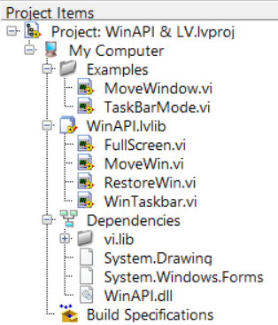
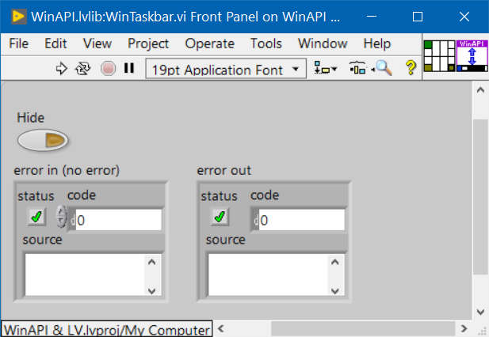
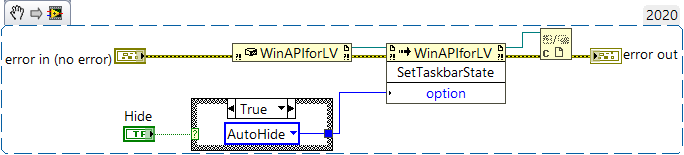
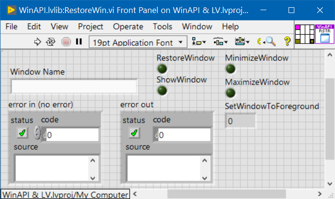
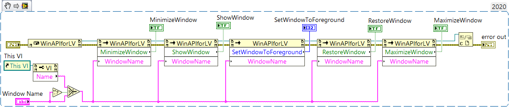
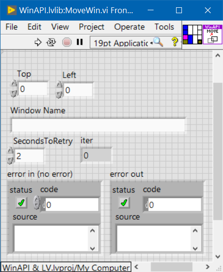
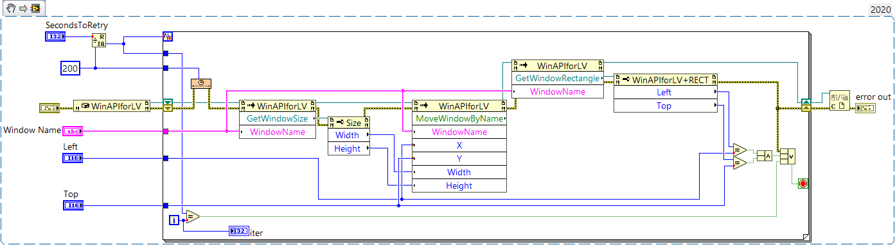
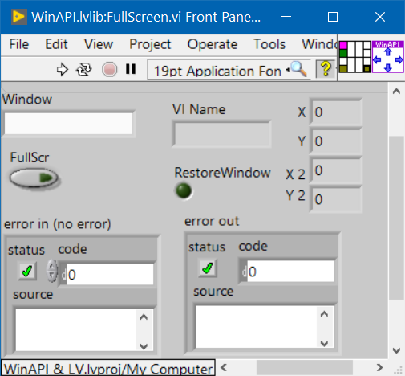
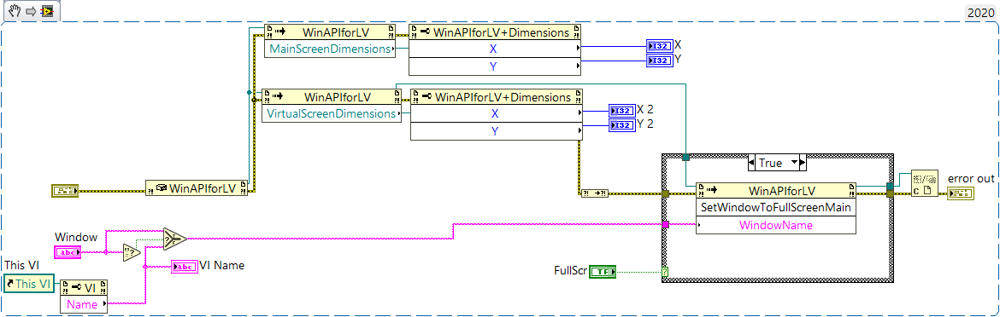

# LabVIEW wrapper LIB & examples that use WinAPI.dll 
 LabVIEW LIB & examples that use custom WinAPI.dll (InteropAssembly that wrapps user32 and shell32 functions for Window, Taskbar, Screens, etc manipulation) 
 
[WinAPI.dll](https://etfovac.github.io/WinAPI/) consists of Win API functions for Window, Taskbar, Screens, etc, conveniently organized and wrapped in a C# DLL.

See this repo in NI Forums > Example Code: <a href="https://forums.ni.com/t5/Example-Code/LIB-that-uses-DLL-to-easily-manipulate-Windows-Taskbar-Screens/ta-p/4076017">LIB that uses DLL to easily manipulate Windows, Taskbar, Screens, etc</a>  

### Project Overview
  

### Snippets  
  
  
  
  
  
  
  
  

### References:  
<a href="https://etfovac.github.io/WinAPI/">my WinAPI GitHub project</a>
